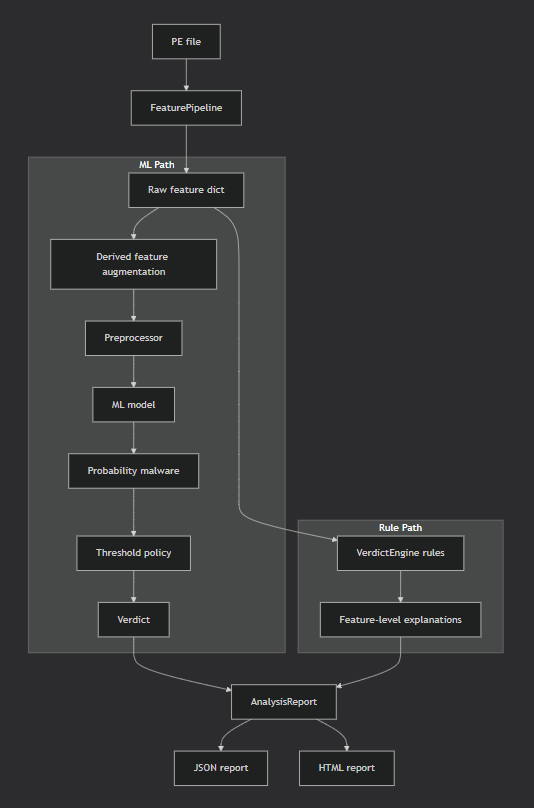
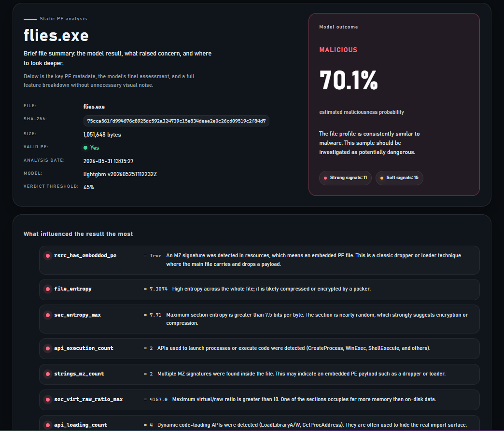
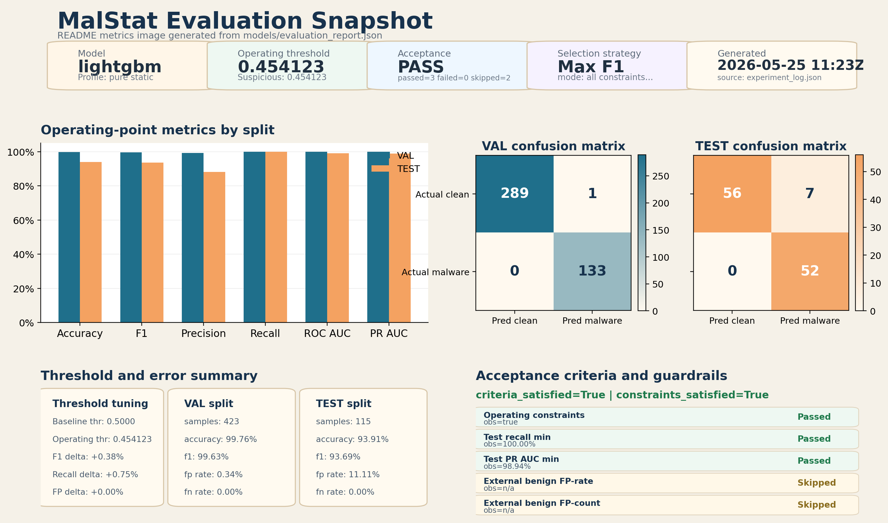

# MalStat

   __  ___     ________       __ 
  /  |/  /__ _/ / __/ /____ _/ /_
 / /|_/ / _ `/ /\ \/ __/ _ `/ __/
/_/  /_/\_,_/_/___/\__/\_,_/\__/ 
                                 

MalStat is a static PE malware triage toolkit for Windows executables. It extracts structural features from EXE, DLL, and SYS files, applies a calibrated machine learning classifier, and produces explainable JSON and HTML reports without executing the sample.



## Why this repository exists

This repository is the clean public runtime repository for the MalStat project.

It intentionally contains:

- the canonical source code under `src/` and `scripts/`;
- the minimal runtime model bundle under `models/`;
- the runtime template and configuration files required for inference;
- the training and evaluation code paths for users who provide their own local datasets.

It intentionally does **not** contain private datasets, training/evaluation outputs, or the separate author-side coursework documentation folder that lives outside this repository.

## Key capabilities

- Static analysis of Windows PE files without running them.
- Feature extraction across file, header, section, import, string, resource, opcode, and optional reputation layers.
- Calibrated `LightGBM` inference with canonical model artifacts already included.
- JSON and HTML reporting for single-file and batch workflows.
- Reproducible retraining once you provide a local clean training subset.
- Evaluation tooling for threshold selection, error review, and external holdout checks against local artifacts.



## Repository layout

```text
.
|- configs/                 Runtime and evaluation configuration
|- data/                    Local ignored workspace for private datasets and generated dataset artifacts
|- models/                  Canonical runtime model bundle only
|- scripts/                 CLI entry points for analysis, dataset building, training, and evaluation
|- src/                     Core project implementation
|- templates/               HTML report template(s)
|- tests/                   Minimal smoke tests for CI
|- CHANGELOG.md             Release notes
|- Dockerfile               Reproducible container runtime
|- README.md                This document
|- VERSION                  Repository release version
`- requirements.txt         Exact tested dependency set
```

## What lives where

### Runtime and inference

- `scripts/analyze_file.py` analyzes one file.
- `scripts/analyze_directory.py` analyzes a directory tree.
- `src/inference/` contains the runtime analysis path.
- `src/reporting/` renders the explainable output payloads.

### Dataset and training

- `scripts/build_dataset.py` extracts and appends rows into aggregate dataset stores.
- `scripts/export_clean_training_subset.py` exports the clean supervised subset.
- `scripts/train_model.py` trains the canonical classifier.
- `scripts/evaluate_model.py` builds detailed evaluation reports.
- `src/training/` and `src/evaluation/` contain the training and evaluation logic.

### Published artifacts

- `models/calibrated_model.pkl` is the canonical shipped classifier.
- `models/preprocessor.pkl` is the canonical feature preprocessor.
- `models/feature_columns.json` fixes the expected feature order.

### Generated at runtime

- `reports/` is for generated analysis outputs and is intentionally gitignored.
- `data/` is a local working area for private datasets and exported training subsets and is intentionally gitignored.
- non-runtime files under `models/` such as experiment logs, evaluation reports, prediction tables, and best snapshots are intentionally gitignored.

## System requirements

- Python `3.13.x`
- `pip` and `venv`
- A platform supported by the pinned wheels in `requirements.txt`
- Enough disk space for model artifacts, generated reports, and optional dataset growth

This project analyzes Windows PE files, but the tooling itself can be run from a non-Windows host because it performs static parsing instead of sample execution.

## Quick start

### 1. Create a virtual environment

#### PowerShell

```powershell
python -m venv .venv
.\.venv\Scripts\Activate.ps1
python -m pip install --upgrade pip setuptools wheel
python -m pip install -r requirements.txt
```

#### Bash

```bash
python3 -m venv .venv
source .venv/bin/activate
python -m pip install --upgrade pip setuptools wheel
python -m pip install -r requirements.txt
```

### 2. Verify the shipped CLI entry points

```powershell
python scripts/analyze_file.py --help
python scripts/analyze_directory.py --help
python scripts/train_model.py --help
python scripts/evaluate_model.py --help
```

### 3. Run the first analysis

Analyze a single file:

```powershell
python scripts/analyze_file.py "C:\path\to\sample.exe"
```

Analyze a directory recursively:

```powershell
python scripts/analyze_directory.py "C:\path\to\samples" --recursive --no-html
```

By default, generated outputs are written under `reports/`, which is ignored by Git on purpose.
VirusTotal lookups are disabled by default. Add `--enable-virustotal` only when you explicitly want remote hash reputation lookups and have configured `VT_API_KEY` in the environment or `.env`.

## First-run workflows

### Single-file inference

```powershell
python scripts/analyze_file.py "C:\path\to\sample.exe" --json-out sample.analysis.json --html-out sample.analysis.html
```

### Batch inference

```powershell
python scripts/analyze_directory.py "C:\path\to\samples" --recursive --output-root reports\batch_analysis\run01
```

### Build dataset rows from a new file or directory

These dataset and training workflows require a private local dataset workspace under `data/`; they are not part of the public runtime bundle.

```powershell
python scripts/build_dataset.py "C:\path\to\samples" --source manual --label 0 --label-confidence high
```

### Export the clean supervised training subset

```powershell
python scripts/export_clean_training_subset.py
```

### Retrain the canonical classifier

```powershell
python scripts/train_model.py
```

### Rebuild the evaluation report

```powershell
python scripts/evaluate_model.py
```

## Optional tooling

The repository works without the tools below. Install them only if you need the associated workflow.

### FLOSS

FLOSS improves string extraction for obfuscated samples.

Preferred installation method on Windows:

1. Download the standalone executable from the official Mandiant FLARE-FLOSS releases page.
2. Put `floss.exe` on your `PATH`, or place it in a known tools directory and configure your environment accordingly.

Alternative Python package installation:

```powershell
python -m pip install flare-floss
```

### VirusTotal

VirusTotal lookups are opt-in.

- Set `VT_API_KEY` in your environment or local `.env` file.
- Add `--enable-virustotal` to `scripts/analyze_file.py`, `scripts/analyze_directory.py`, `scripts/main_extractor.py`, `scripts/build_dataset.py`, or `scripts/backfill_dataset_features.py` when you explicitly want remote hash lookups.
- Leave the flag unset to keep analysis fully local.

### SHAP

Use SHAP only if you want additional post-hoc explanations for trained models.

```powershell
python -m pip install shap
```

### Plotly and Kaleido

Use Plotly for richer interactive plots and Kaleido for static image export.

```powershell
python -m pip install plotly kaleido
```

### PyTorch

PyTorch is optional and only relevant if you add experimental neural baselines.

Use the official installer selector when possible because CPU and CUDA wheels differ by platform.

Typical CPU-only installation example:

```powershell
python -m pip install torch --index-url https://download.pytorch.org/whl/cpu
```

## Canonical snapshot included in this repository

- Canonical model version: `20260525T112232Z`
- Canonical classifier: `lightgbm`
- Canonical operating threshold: `0.454123`
- Published repository version: `0.1.0`

## Reproducibility

This repository includes several reproducibility controls:

- `requirements.txt` pins the exact tested Python package versions.
- `VERSION` is the single source of truth for repository releases.
- `CHANGELOG.md` records repository-level release notes.
- `Dockerfile` provides a reproducible runtime container.
- GitHub Actions validates install, CLI help paths, smoke tests, and Docker buildability.

## CI/CD

The repository ships with:

- `CI` workflow: installs pinned dependencies, runs smoke tests, validates CLI entry points, and builds the Docker image.
- `Release` workflow: validates that the Git tag matches `VERSION`, creates a source archive, and attaches it to the GitHub release.

## Release discipline

Use this release process for clean GitHub releases:

1. Update the code and documentation.
2. Update `VERSION` using Semantic Versioning, for example `0.2.0`.
3. Add the release notes to `CHANGELOG.md`.
4. Commit the release changes.
5. Tag the release as `vX.Y.Z`, for example `v0.2.0`.
6. Push the tag to trigger the release workflow.

## Minimal maintenance checklist

- Keep `requirements.txt` pinned.
- Keep generated outputs out of version control.
- Update `CHANGELOG.md` for every release.
- Re-run the smoke tests after changing model artifacts.
- Treat `models/calibrated_model.pkl`, `models/preprocessor.pkl`, and `models/feature_columns.json` as the published runtime contract.

## Typical output examples



After a successful single-file run, you should expect:

- a JSON analysis payload;
- an optional HTML report;
- a printed summary in the terminal with the verdict, probability, threshold, model name, and model version.

## Scope note

MalStat is a static triage tool. It is designed to prioritize and explain suspicious PE files, not to behave like a full production antivirus engine with dynamic detonation, live telemetry, or enterprise response orchestration.

                                                                                             
                                        :+xXX$$$$$$$$$Xx:                                    
                                   ++++;;;+xXxxXXXXXXXXX$$&$X+                               
                                ::::;+xXXX$$$XXXxxx++xX$$$$$$$&&$;                           
                             .::+$&&&$$&&&$$$$$$$XX$$X;;;x$$X$$$$&&$x                        
                           :;X&&&&&&$$XXXXXXxxXxxxxxXxxxx+:;x$$$$$$&&&X:                     
                         :x&&&&&$$$xxxxxx+++++;;;;;;++++++xx:;x&&$&$$&&&$;                   
                       :X&&&&&$$XXXxx++xX;++++x:::::::::;+x;++;+X&&$&$$&&&X:                 
                     .x&&&&&&$$Xxxxx+;;;X+;;;;x:::::::::;;:;;+++;x$&&&$$$&&$X                
                    :$&&$X+X$XX$xx++;;::+x:;;;+:::::::::X;::::+;+++X&&$&$$&&&$;              
                  .x&&&: +x+xX$X$+;;;;:::x:;;++::::::::X+::::::;;:++x&&$&$$$&&$+             
                 .$&&$    xxxXxxxX;;::::;x:;;++:::::::x;:::::::::;;+;x&&$&$$$&&$$            
                .$&&$      :++Xx;xx:::::x++;;++::::::++:::::::::::;;;+x$&$&$$$&&Xx           
               .$&&&      .;;+;xX:x+:::;:;x;;+;:::::xx::::::::::::::+;;X&&$&$$$&&$X          
              .$&&&.     .;;;;;+;x;X;::::::::;:::::++::::::::::::::::+x+x&&$&$$$&&$+         
              X&&&$.     ;:;;;::+:::.:::::::.;:;:::::::::::::::::X$+:;;;xX&&&$$$&&$$:        
             ;&&&&X$Xx. ::;;;:::::   ;;:::::+;;+++::::::::::::x$+:+$X:;+;X$&$&$$$&&XX        
            .$&&&+  ;+xx;;;;:::::.   ..:::::x:;+;::;:::::.:;Xx:;x$;::::;;+X&$&&$$$&&X+       
            +&&&X.  ; .;;$Xx+::::.   ...::::x;++;::::;::.:;;:+$+::::::::+:x&&$&$$$&&XX       
           .$&&&x. ;. .;:;+:;:::;..  ..::::;;:;;::::::;::::xx:::::::::::+:x$&$&$&$$&$X;      
           ;&&&&;:.; .;::;:x:::;:   ...::::+;;;;:::::::::::::::::::::::::;+X&$$&$$$&$X+      
           +&&&$. ::.:;::;::::+:.   ...:::.x:;;::::.::::;::::::::::::::::+;X$&$&$$$&&XX      
           x&&&X:.:::.;::::::;::..  ...::::x:;;:::::::::;::::::::::::::::;:X$&$&$&$$&XX      
          .X&&&x;::::.:::;;::+::. . ...:::;x:+;::::::.:::+:::+XXXXX$X$$$;::XX&$&$&$$&XX.     
          .$&&&x;:::::xxx;::::::....:;;:;xxxXx;::::::::::X::::;;;;:;;;;;:::xX$$&X$$&&XX:     
          .$&&&x;;+;::::;;;:::::....:x+xxx$XXXXXXXXXXXxxxxxx+;;;;;;;;;;+:::XX$$&X&$$&XX:     
          .$&&&x::x;::++xx;::;::.......::+x+xxx+++++++xxxXx++X&&$$$$$$$$;::X$$$&$&$$&XX.     
          .X&&&X:;;;:::::::::;::........:xX;++;:::::::::;;:;;;;;;;;;:::::;;X$&$&X$$$&Xx      
          .x&&&&XXx+;:::+X+:::+:........::::;;::::::::::;::::::::::::::::+;X$&$&$$$&&Xx      
           x&&&$xxxxx+X$;:X+:::;::::....::::::::::::.::::.:.:::::.:::::::;+$&$$$$$$&$x;      
           ;&&&&&$$$$X;xX+:x+::;::::::..:::::.::::::::;;:..:+Xx:::::::::+:x&&$&$&$&&$x:      
           .X&&&&$$XX$X;;$x::::::+::::...:::.::::::::;::::;+:::x$+:::::;;;X&&$&$$$&&Xx       
            ;&&&&&&$XxX$+:+xX;:::::;:........::...:;;......;$XXx;;X$+::;.X&&$&$$X$&$x;       
            :x&&&&$$$$xX+;X;:::;:::::;:::......::+:....::::::;x;+$$++;;:+X&&$&X$$&&x+        
             ;$&&&&&$$x+$x::::;x:X:::::::::;:::::::::::::::::::;x:::;;:;X&&$&$$X&&X+         
              +&&&&&&$X$+;:::;X:$;:x...........:::::+::::::::::::;x;;;.X$&$&$$X$&$+:         
              :+$&&&&$$X+;;:;X:x::$;:..:x;.:....::::X$:::::::::::::;;:X$&&$&X$$&&+;          
               :x$&&&&&$X+;;X;x+;xx.....x+.$:..::::.:XX;::::::::::;;:x$&&$$X$$&$+;           
                :x$&&&&&$$+&;Xx+:x;.....x+.X;..::::::;+&x::::::::x+:X$&$$&XX$&&+;            
                 .XX&&&&&$Xx+xx;;x:::...x++;;..:::::::+:xX:::::+;:+X&&$$$XX$&$+.             
                   +x$&&&&$XXx;;X::.....++$;x.:::::::::x:+$;:;;::X$&&X&$$X$&X;               
                    :xx$&&&&$X++;:::::::x+x:X::::::::::x;:;+;;:+$&&$$$XXX&&+.                
                      +xx$&$&&$X+++;::::xx;:X::::::::::;+;X;;;X$&$$&XXX$&X:                  
                        +XxX&&$$$xx++;;++;:::::::;++;;:x+;:xX$&$X&XXX$&X;                    
                          ;XXxX$$$$Xx++x++x;;;+;;;;+x+;;+X$$$X$$XXX&&X:                      
                            ;+XXX++x$$$XXxxxx+x+x+.:xX$$&$XX&XXx$&&+                         
                               ;xxxXXXXXxxxxxxX$$$$$$XXXX$XxX$&$;                            
                                   xXXxxx+xxxx++xX$$XxxxX$&$+                                
                                        .;xX$$$$$$$$Xx;.                                     
                                                                                             